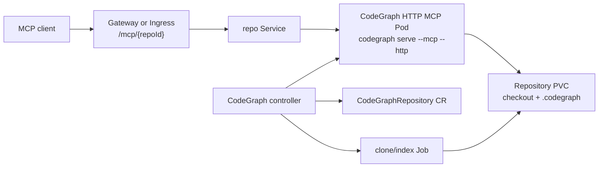

# CodeGraph Cloud-Native CRD Design

Date: 2026-06-16

## Summary

The first cloud-native version exposes many repository-scoped CodeGraph MCP servers behind one shared MCP entry point without adding a custom Python proxy. Kubernetes owns repository lifecycle through a custom resource, and standard cloud-native routing maps each repository URL path to its own CodeGraph HTTP MCP service.

Confirmed scope:

- Use URL path routing for the shared MCP address: `https://<host>/mcp/<repoId>`.
- Do not implement a Python proxy in the first version.
- Add a custom Kubernetes resource that manages git checkout, indexing, and serving for each repository.
- Keep each repository isolated at runtime: one repository resource reconciles to its own storage, index job, deployment, service, and route.

## Goals

- Let users connect MCP clients through one stable host while selecting repositories by path.
- Let platform teams add or update repositories declaratively through Kubernetes YAML.
- Keep CodeGraph's existing HTTP MCP server as the serving primitive.
- Make repository sync, indexing, health, and route status observable through Kubernetes status fields.
- Keep the first version small enough to implement and test without building a new transport proxy.

## Non-Goals

- No Python proxy service in the first version.
- No cross-repository MCP session that queries multiple repositories in one request.
- No user-facing repository picker API.
- No automatic agent installer changes for remote MCP URLs in this first CRD design.
- No multi-tenant authorization policy beyond Kubernetes resource and secret boundaries.

## Existing Repository Facts

CodeGraph already has an HTTP MCP serving mode exposed through the CLI:

```bash
codegraph serve --mcp --http --host 0.0.0.0 --port 3000 --path /workspace/repo
```

The HTTP server currently serves one project path per process and exposes a single MCP endpoint, normally `/mcp`. It is a good fit for a per-repository pod model because Kubernetes can place a route in front of each pod instead of requiring the Node process to understand every repository.

The current server only accepts exact endpoint paths and does not act as a multi-repository router. Therefore the cloud-native design delegates external path matching to Gateway API or Ingress and rewrites `/mcp/<repoId>` to the pod-local `/mcp` endpoint.

## Recommended Architecture

Use a Kubernetes operator with a `CodeGraphRepository` CRD. Each custom resource declares one git repository and its MCP route. The controller reconciles Kubernetes primitives for that repository.



This keeps the data plane simple:

- Gateway or Ingress owns the shared host and path routing.
- Each repository gets a normal Kubernetes Service.
- Each runtime pod runs the existing CodeGraph HTTP MCP server against a mounted repository.
- The operator owns lifecycle and status, not request forwarding.

The preferred implementation is a Go operator using Kubebuilder or controller-runtime. That matches Kubernetes conventions for CRD schema generation, status updates, watches, owner references, and envtest-based tests. A TypeScript controller is possible, but it would be less conventional for this kind of Kubernetes control plane.

## Custom Resource

Initial API group and version:

```yaml
apiVersion: codegraph.dev/v1alpha1
kind: CodeGraphRepository
metadata:
  name: api-service
spec:
  repoId: api-service
  git:
    url: https://github.com/acme/api-service.git
    ref: main
    authSecretRef:
      name: api-service-git
  mcp:
    host: codegraph.example.com
    path: /mcp/api-service
  storage:
    size: 20Gi
  sync:
    mode: manual
```

### Spec Fields

`repoId` is the stable route and resource identifier. It must be DNS-label safe and unique within a namespace.

`git.url` is the clone URL. HTTPS and SSH are both allowed if credentials are supplied through a Secret.

`git.ref` is the branch, tag, or commit to index. The controller records the resolved commit in status.

`git.authSecretRef` points to a Kubernetes Secret. The CRD does not inline credentials.

`mcp.host` is the shared external host.

`mcp.path` is the external path. The first version expects `/mcp/<repoId>`.

`storage.size` declares the PVC size for checkout and `.codegraph` data.

`sync.mode` controls refresh behavior. First version supports `manual`; later versions can add `interval` or webhook-triggered sync.

Optional fields can be added without changing the architecture:

- `image` for overriding the CodeGraph runtime image.
- `resources` for runtime and job CPU/memory requests.
- `storageClassName` for PVC placement.
- `nodeSelector`, `tolerations`, and `affinity` for scheduling.

### Status Fields

The controller writes status that is useful to users and automation:

```yaml
status:
  observedGeneration: 3
  phase: Ready
  conditions:
    - type: Ready
      status: "True"
      reason: RuntimeAvailable
      message: MCP endpoint is serving
    - type: Indexed
      status: "True"
      reason: IndexSucceeded
      message: Repository indexed successfully
  resolvedRef: 2f6a2a7
  lastSyncTime: "2026-06-16T10:00:00Z"
  endpoint: https://codegraph.example.com/mcp/api-service
  serviceName: codegraph-api-service
  routeName: codegraph-api-service
```

Phases:

- `Pending`: resource accepted, owned resources not ready yet.
- `Syncing`: clone or fetch job is running.
- `Indexing`: CodeGraph index job is running.
- `Ready`: route, service, runtime pod, and index are ready.
- `Degraded`: last reconcile failed but retry is possible.

## Reconciled Resources

For a `CodeGraphRepository` named `api-service`, the controller creates resources with deterministic names:

- `PersistentVolumeClaim/codegraph-api-service`
- `Job/codegraph-api-service-sync-<generation-or-hash>`
- `Deployment/codegraph-api-service`
- `Service/codegraph-api-service`
- `HTTPRoute/codegraph-api-service` when Gateway API is enabled
- `Ingress/codegraph-api-service` when Ingress mode is configured

All resources carry labels:

```yaml
app.kubernetes.io/name: codegraph
app.kubernetes.io/component: repository-mcp
codegraph.dev/repo-id: api-service
```

Owner references point back to the `CodeGraphRepository` so garbage collection removes repository-owned resources when the CR is deleted.

## Data Flow

1. User applies a `CodeGraphRepository`.
2. Controller validates the route and git settings.
3. Controller creates or updates the PVC.
4. Controller runs a sync/index Job that clones or fetches the repository and runs CodeGraph initialization and indexing into the mounted workspace.
5. Controller starts or rolls the runtime Deployment after the index is ready.
6. Runtime pod serves `POST /mcp` through CodeGraph's existing HTTP MCP server.
7. Gateway API or Ingress receives `POST /mcp/<repoId>` and forwards the request to that repository Service, rewriting the path to `/mcp`.
8. Controller updates status with resolved commit, endpoint, conditions, and failures.

## Routing

Gateway API is the preferred routing API for the first version because it models shared gateways and path-based HTTP routing directly. In clusters without Gateway API, an Ingress mode can provide a compatibility path.

The route behavior is:

- External path: `/mcp/<repoId>`
- Backend service: `codegraph-<repoId>:3000`
- Backend path: `/mcp`
- Methods: MCP clients primarily use `POST`

The controller should not assume a specific ingress controller. It should emit either Gateway API `HTTPRoute` resources or standard `Ingress` resources based on operator configuration.

References:

- Kubernetes Gateway API: https://kubernetes.io/docs/concepts/services-networking/gateway/
- Gateway API project documentation: https://gateway-api.sigs.k8s.io/
- Kubernetes Custom Resources: https://kubernetes.io/docs/concepts/extend-kubernetes/api-extension/custom-resources/

## Failure Handling

Git authentication failure:

- Mark `Indexed=False`.
- Set phase to `Degraded`.
- Keep the previous ready runtime serving if one exists.

Git ref not found:

- Mark `Indexed=False`.
- Record the failing ref in the condition message.
- Retry only on spec changes or manual resync.

Index failure:

- Mark `Indexed=False`.
- Preserve logs in the failed Job.
- Keep the previous ready runtime serving if one exists.

Runtime crash:

- Let Deployment restart policy handle restarts.
- Mark `Ready=False` if pods are unavailable.

Route conflict:

- Mark `Ready=False` with a route conflict reason.
- Do not delete another repository's route.

PVC full:

- Mark `Indexed=False`.
- Surface a storage-specific condition message.
- Do not automatically resize storage unless Kubernetes storage class and policy allow it in a later version.

## Security

Credentials are always read from Kubernetes Secrets. The custom resource only references them.

Each repository runs in its own workload with its own PVC. This avoids sharing a single process across repositories and limits blast radius.

The runtime container should run as non-root where the image supports it. The generated Deployment should expose only the MCP HTTP port inside the cluster.

The first version does not define end-user authorization at the MCP layer. Authentication and authorization for the shared host should be handled by the cluster ingress layer or a future gateway policy design.

## Testing Strategy

Controller tests:

- CRD schema validation for required fields and invalid `repoId` or `mcp.path`.
- Reconcile creates PVC, Job, Deployment, Service, and route resources.
- Status transitions for successful sync/index/ready.
- Status behavior for git failure, index failure, route conflict, and unavailable runtime.
- Owner references and labels are applied consistently.

Manifest tests:

- Rendered Gateway API route maps `/mcp/<repoId>` to the right Service.
- Ingress fallback renders equivalent path routing where supported.
- Generated runtime command uses `codegraph serve --mcp --http --host 0.0.0.0 --port 3000 --path /workspace/repo`.

End-to-end cluster test:

- Apply one `CodeGraphRepository`.
- Wait for `Ready=True`.
- Send an MCP initialize request to `https://<host>/mcp/<repoId>`.
- Verify the response comes from the indexed repository.

Multi-repository test:

- Apply two `CodeGraphRepository` resources.
- Confirm each path routes to its own Service and repository workspace.
- Confirm deleting one CR does not disrupt the other.

## Implementation Boundaries

This design intentionally keeps CodeGraph server changes minimal. If path rewriting is available at the Gateway or Ingress layer, the Node HTTP server does not need to understand `/mcp/<repoId>` internally.

If a target ingress cannot rewrite paths reliably, the smallest CodeGraph change would be adding a configurable HTTP endpoint path to `MCPHttpServer` and CLI flag wiring. That should be treated as a compatibility enhancement, not the default design.

## Rollout Plan

1. Add operator project and CRD manifests under a deployment-focused directory.
2. Define `CodeGraphRepository` API types and generated CRD schema.
3. Implement reconciliation for PVC, sync/index Job, runtime Deployment, Service, and Gateway API route.
4. Add status conditions and failure handling.
5. Add unit and envtest coverage.
6. Add a sample manifest for one repository.
7. Document how an MCP client connects to `https://<host>/mcp/<repoId>`.

## Open Follow-Up After Spec Approval

The next step is an implementation plan. That plan should split work into small commits, starting with CRD schema and controller resource rendering before adding sync/index execution details.
