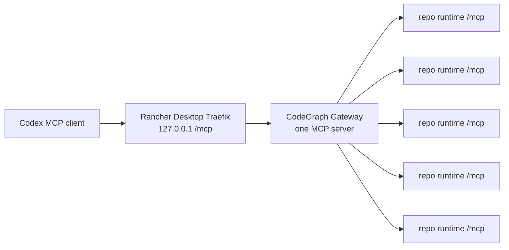

# CodeGraph Kubernetes MCP Gateway Design

Date: 2026-06-16

## Summary

Add a cloud-native MCP Gateway so Codex connects to one URL only:

```text
http://127.0.0.1/mcp
```

The gateway exposes one MCP server to the client and aggregates multiple repository-scoped CodeGraph HTTP MCP servers behind it. Repository runtimes stay isolated and unchanged: each `CodeGraphRepository` still owns its checkout, index, Deployment, Service, and internal `/mcp` endpoint. The new gateway is the only external MCP address.

## Goals

- Codex uses exactly one `config.toml` entry.
- A Kubernetes CRD declares the gateway and the repositories it exposes.
- The gateway is not implemented in Python.
- The gateway works with existing CodeGraph HTTP MCP runtimes.
- Rancher Desktop verification starts at least five repositories and validates one shared `/mcp` endpoint.

## Non-Goals

- No authentication policy in the gateway for this version.
- No cross-repository query planner that merges answers from multiple repositories in one tool call.
- No replacement for `CodeGraphRepository`; repository lifecycle stays per-repo.
- No client-side repository selector or multiple Codex MCP entries.

## Architecture

The data plane is:



The control plane adds a `CodeGraphGateway` CRD. A gateway resource reconciles to:

- a ConfigMap containing repository backend mappings;
- a Deployment running the Node-based CodeGraph MCP gateway;
- a ClusterIP Service;
- an Ingress or Gateway API route exposing exactly `/mcp`.

## Gateway Runtime

The gateway speaks the same minimal Streamable HTTP shape as `MCPHttpServer`: JSON-RPC over `POST /mcp`, with `Accept: application/json, text/event-stream`.

It handles these methods locally:

- `initialize`: returns gateway server info and MCP tool capability.
- `initialized`: returns HTTP 202 with no body.
- `tools/list`: calls every configured backend `tools/list`, prefixes tool names with a stable repo prefix, and returns one combined tool list.
- `tools/call`: parses the repo prefix, forwards the call to that backend with the original tool name, and returns the backend result.
- `ping`, `resources/list`, `resources/templates/list`, `prompts/list`: returns small successful responses.

Tool names are namespaced with `<repoId>__<toolName>`, for example:

```text
hello-1__codegraph_explore
hello-2__codegraph_node
```

This keeps Codex behavior simple: it sees one MCP server with many tools and does not need multiple server URLs.

## Gateway CRD

Example:

```yaml
apiVersion: codegraph.dev/v1alpha1
kind: CodeGraphGateway
metadata:
  name: local
  namespace: codegraph-verify
spec:
  host: 127.0.0.1
  path: /mcp
  repositories:
    - repoId: hello-1
      serviceName: codegraph-hello-1
    - repoId: hello-2
      serviceName: codegraph-hello-2
    - repoId: hello-3
      serviceName: codegraph-hello-3
    - repoId: hello-4
      serviceName: codegraph-hello-4
    - repoId: hello-5
      serviceName: codegraph-hello-5
```

For the first version the repository list is explicit. The operator converts each entry into an in-cluster backend URL:

```text
http://<serviceName>.<namespace>.svc.cluster.local:3000/mcp
```

## Error Handling

- If a backend `tools/list` fails, the gateway omits that backend from the list and includes a warning tool response only when a routed call targets it.
- If `tools/call` references an unknown prefix, the gateway returns JSON-RPC `InvalidParams`.
- If a backend returns JSON-RPC error, the gateway passes that error through.
- If all backends are unavailable, `tools/list` returns an empty list rather than marking the MCP server broken.

## Testing

TypeScript tests cover:

- `initialize` on the gateway.
- `tools/list` prefixes tools from two fake backend MCP servers.
- `tools/call` strips the prefix and forwards to the selected backend.
- unknown tool prefixes return `InvalidParams`.

Operator tests cover:

- `CodeGraphGateway` scheme registration and endpoint helpers.
- gateway ConfigMap, Deployment, Service, and route resource builders.
- gateway reconciler creates resources and reports status.

End-to-end verification covers Rancher Desktop:

- five `CodeGraphRepository` resources become ready;
- one `CodeGraphGateway` resource becomes ready;
- `POST http://127.0.0.1/mcp` initializes successfully;
- `tools/list` returns tools for all five repos;
- a namespaced `tools/call` reaches one backend.

## Codex Configuration

The target user configuration is:

```toml
[mcp_servers.codegraph_k8s]
url = "http://127.0.0.1/mcp"
enabled = true
```

